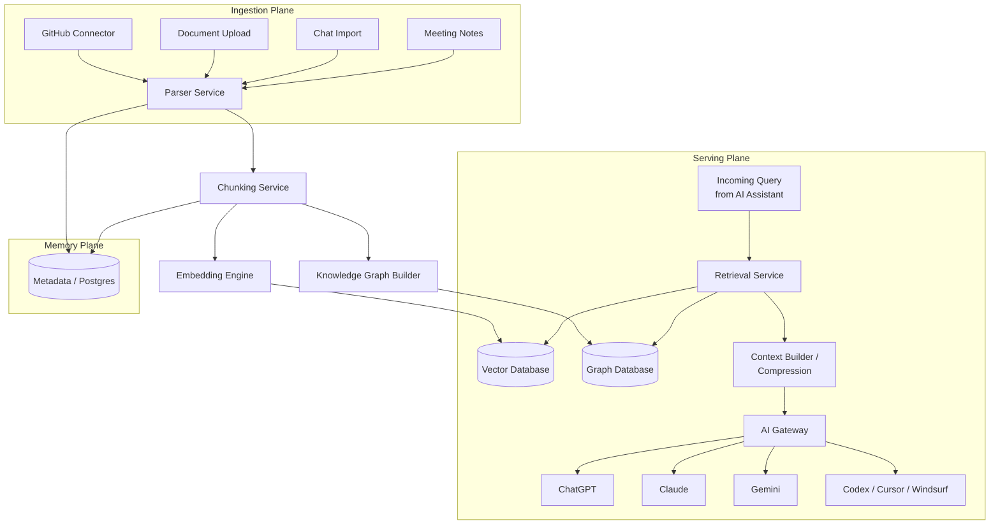
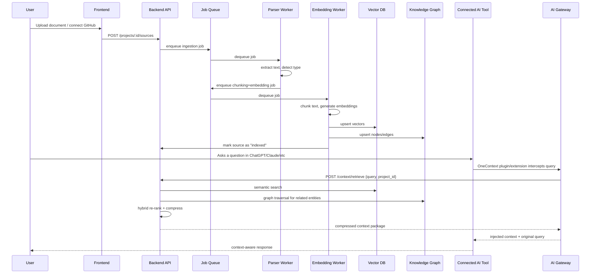
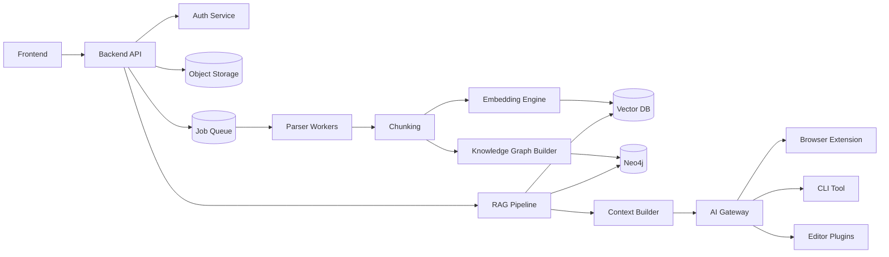
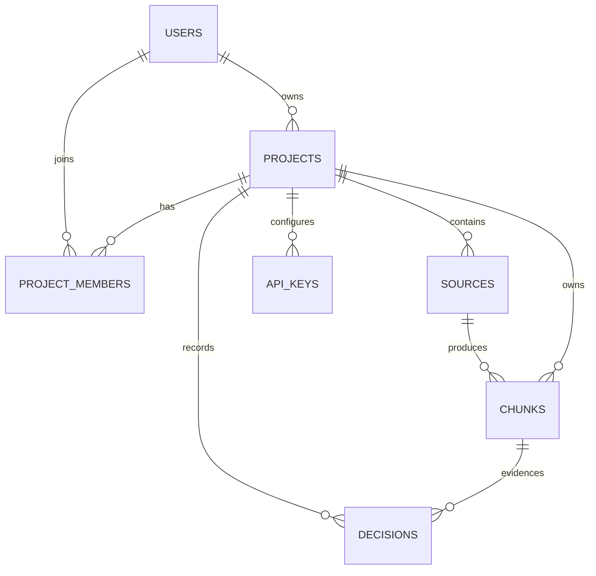
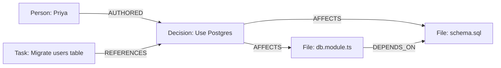

# OneContext — AI Project Memory for Every Assistant
## Software Requirements Document & Technical Implementation Plan

**Version:** 1.0
**Prepared for:** OpenAI Build Week Hackathon (Developer Tools Track)
**Document Owner:** Engineering Lead
**Status:** Draft for Team Build

---

## Table of Contents

1. Executive Summary
2. Problem Statement
3. Market Analysis
4. Target Users
5. User Personas
6. Project Vision
7. Goals
8. Non-Goals
9. Functional Requirements
10. Non-Functional Requirements
11. System Architecture
12. Detailed Workflow
13. Component Architecture
14. Folder Structure
15. Database Schema
16. API Design
17. Frontend Pages
18. Backend Modules
19. RAG Pipeline
20. Knowledge Graph
21. Project Memory Design
22. AI Integration Layer
23. Technology Stack
24. Team Responsibilities
25. Development Roadmap
26. Testing Strategy
27. Deployment Plan
28. Future Roadmap
29. Possible Challenges
30. Risk Mitigation
31. Future Features
32. Competitive Analysis
33. Business Model
34. Demo Flow
35. Presentation Script
36. README Structure
37. GitHub Branch Strategy
38. Contribution Guidelines
39. Project Milestones
40. Final Conclusion
41. Implementation Checklist

---

## 1. Executive Summary

OneContext is a centralized, AI-agnostic project memory layer that solves a problem every developer using multiple AI coding assistants runs into daily: **every assistant starts from zero.** ChatGPT, Claude, Gemini, Cursor, Windsurf, and Codex each maintain their own isolated conversational memory. None of them share an understanding of a project's architecture, coding conventions, prior decisions, or open tasks. As a result, developers spend a meaningful fraction of their week re-explaining context that they've already explained a dozen times to a dozen different tools.

OneContext ingests a project's source of truth — its codebase, documentation, GitHub history, meeting notes, and prior AI conversations — and continuously distills that material into a structured, queryable memory. When a developer asks any connected AI assistant a question, OneContext intercepts the request, performs semantic retrieval over the project's memory graph, compresses the most relevant context into a token-efficient package, and injects it into the assistant's prompt before the assistant ever sees the question. The assistant responds as though it has always known the project.

This document is the single source of truth for the engineering team building OneContext during OpenAI Build Week. It specifies the product requirements, system architecture, data models, APIs, and a day-by-day build plan sized for a small team working over the course of the Submission Period. It is written so that a developer joining the project mid-hackathon can read this document top to bottom and understand exactly what to build, why it's built that way, and what "done" looks like for each component.

The hackathon submission targets the **Developer Tools** track, built primarily with Codex and GPT-5.6, consistent with the OpenAI Build Week Official Rules.

---

## 2. Problem Statement

Modern software development increasingly happens in conversation with AI assistants — but developers rarely use just one. A typical week might involve ChatGPT for architecture discussions, Claude for code review and documentation, Cursor or Windsurf for in-editor pair programming, and Codex for autonomous task execution. Each of these tools is excellent in isolation, but none of them know what the others know.

This produces three compounding costs:

**1. Repetition tax.** Developers re-type the same project context — tech stack, folder structure, coding standards, business rules — into every new AI session. Across a team, this is duplicated work performed by every engineer, every day.

**2. Inconsistency.** Because each assistant reasons from a different (and usually incomplete) slice of context, they give contradictory answers. One tool suggests a database schema; a different tool, unaware of that schema, proposes a conflicting one. Bugs and rework follow.

**3. Lost institutional memory.** Decisions made in a ChatGPT conversation on Monday are invisible to the Claude session on Tuesday. There is no durable, searchable record of *why* the team chose one architecture over another, which becomes a serious liability as a codebase and team grow.

There is currently no neutral, cross-assistant memory layer that treats "the project" — rather than "the conversation" — as the unit of memory.

---

## 3. Market Analysis

### 3.1 Current Problems

- AI coding assistants are proliferating faster than any standard for sharing context between them.
- Context windows have grown, but that only helps within a single session of a single tool — it does nothing for cross-tool consistency.
- Teams often standardize on a single AI tool purely to avoid the context-fragmentation problem, sacrificing the ability to use the best tool for a given task.

### 3.2 Developer Pain Points

| Pain Point | Frequency | Impact |
|---|---|---|
| Re-explaining project context to a new AI session | Daily | 10–30 min lost per occurrence |
| Conflicting suggestions between tools | Weekly | Rework, bugs, confusion |
| Onboarding a new engineer to "how we do things here" | Per hire | Days of ramp-up time |
| Losing track of why a past decision was made | Ongoing | Repeated debate, reversed decisions |
| Switching cost when trying a new AI tool | Per adoption | Discourages experimentation |

### 3.3 Illustrative Statistics

Industry surveys on developer tool usage consistently report that most professional developers now use more than one AI assistant in a given week, and that context-switching overhead is cited as one of the top frustrations with current AI dev tooling. While exact figures vary by survey and shift quickly as the market evolves, the directional signal is unambiguous: multi-tool AI workflows are now the norm, not the exception, and tooling has not kept pace with that reality.

### 3.4 Why Current AI Memory Fails

Existing "memory" features (ChatGPT Memory, Claude Projects, Cursor rules files) are **single-vendor and single-surface**. They:

- Only work inside one product.
- Store memory as unstructured conversational residue rather than a structured project model.
- Have no shared retrieval layer, so a fact learned in one tool cannot be surfaced in another.
- Cannot represent relationships between decisions, files, and people the way a knowledge graph can.

OneContext is designed specifically to sit *underneath* all of these tools rather than compete with any single one.

---

## 4. Target Users

- **Freelancers** — juggle multiple client codebases and AI tools; need instant context switching without re-briefing every session.
- **Students** — use AI tools to learn and build projects across semesters; benefit from a durable memory of what they've already built and learned.
- **Startup Teams** — move fast across a small number of engineers who all touch the same code; consistency between AI-assisted contributions matters enormously at this stage.
- **Software Engineers** — the core daily user; wants less repetition and more accurate, context-aware AI output.
- **Open Source Contributors** — join projects they didn't build; need fast onboarding to codebase conventions and history.
- **Large Enterprises** — many teams, many repos, strict governance; need an auditable, centralized memory layer with access control.

---

## 5. User Personas

### Persona 1 — Priya, Freelance Full-Stack Developer
Manages five client projects concurrently. Switches between Cursor for in-editor work and ChatGPT for client-facing documentation. Loses 20+ minutes a day re-establishing context after switching projects. Wants: instant project switching, zero re-explanation.

### Persona 2 — Daniel, Startup CTO (3-person engineering team)
Uses Claude for architecture decisions and Codex for implementation. Frustrated that decisions discussed in one tool never make it into the other. Wants: a single decision log that all tools can query.

### Persona 3 — Mei, Computer Science Student
Building a capstone project over a semester, using different AI tools depending on which is free or best suited to the task at hand. Wants: continuity of memory regardless of which tool she's using this week.

### Persona 4 — Alex, Senior Engineer at a 200-person Enterprise
Onboards onto a new microservice monthly. Wants: an AI assistant, regardless of vendor, that already knows the service's architecture, on-call runbook, and past incident history.

---

## 6. Project Vision

OneContext aims to become the **memory operating system for software projects** — the layer that every AI assistant, regardless of vendor, plugs into to gain instant, accurate, up-to-date understanding of a codebase and its history. Rather than remembering conversations, OneContext remembers the project itself: its architecture, its APIs, its conventions, and the reasoning behind its evolution.

---

## 7. Goals

- Ingest a project's key sources of truth (code, docs, GitHub, notes) into a structured memory.
- Provide fast, relevant, token-efficient context retrieval via semantic + hybrid search.
- Expose that memory to any connected AI assistant through a lightweight, standardized integration layer.
- Keep memory fresh as the project evolves, without manual re-uploading.
- Ship a working, demoable product within the hackathon Submission Period.

## 8. Non-Goals

- OneContext is not building its own foundation model; it is a retrieval and context-orchestration layer on top of existing LLMs.
- OneContext does not aim to replace any individual AI assistant's UI or workflow — it augments them.
- Real-time multi-user live collaboration (e.g., Google-Docs-style co-editing of memory) is out of scope for the hackathon build.
- Fine-grained enterprise SSO/RBAC is out of scope for the MVP; a simplified auth model is used instead (see Section 10).

---

## 9. Functional Requirements

| ID | Requirement | Priority |
|---|---|---|
| FR-1 | Users can create a Project workspace and invite collaborators | Must |
| FR-2 | Users can upload/connect source materials: GitHub repo, documents (PDF/MD/DOCX), meeting notes (text), and prior AI chat exports | Must |
| FR-3 | System parses and chunks ingested content into semantically coherent units | Must |
| FR-4 | System generates vector embeddings for every chunk and stores them in a vector database | Must |
| FR-5 | System builds a knowledge graph linking files, decisions, people, and tasks | Should |
| FR-6 | Users can query project memory via a chat interface within OneContext | Must |
| FR-7 | System exposes an API/browser extension/CLI that injects relevant context into third-party AI tools (ChatGPT, Claude, Gemini, Cursor, Windsurf, Codex) | Must |
| FR-8 | System performs hybrid (semantic + keyword) search and re-ranks results before injection | Must |
| FR-9 | System compresses retrieved context to fit within a configurable token budget | Must |
| FR-10 | Users can view and browse the knowledge graph visually | Should |
| FR-11 | Users can view a timeline of project decisions and their rationale | Should |
| FR-12 | System automatically re-indexes memory when the connected GitHub repo receives new commits | Should |
| FR-13 | Users can manually mark a memory item as outdated/deprecated | Could |
| FR-14 | System supports per-project settings for which sources are actively indexed | Must |
| FR-15 | System provides authentication and per-project access control | Must |

## 10. Non-Functional Requirements

| Category | Requirement |
|---|---|
| Performance | Context retrieval for a query must complete in under 1.5 seconds at p95 for projects up to 50k indexed chunks |
| Scalability | Vector store and backend services must scale horizontally; ingestion pipeline must be queue-based, not synchronous |
| Reliability | Ingestion jobs must be retryable and idempotent; partial failures must not corrupt existing memory |
| Security | All data encrypted in transit (TLS) and at rest; API keys for connected AI providers stored using envelope encryption |
| Usability | A new user must be able to create a project and get a first useful AI response within 5 minutes |
| Portability | The AI Integration Layer must be provider-agnostic — adding a new AI assistant should not require backend schema changes |
| Observability | All ingestion and retrieval operations must emit structured logs and metrics |
| Cost Efficiency | Context compression must reduce injected token count by at least 60% versus naive full-document injection, without materially degrading answer quality |

---

## 11. System Architecture

OneContext follows a modular, service-oriented architecture. At a high level, three planes exist: the **Ingestion Plane** (gets project data in), the **Memory Plane** (stores and organizes it), and the **Serving Plane** (gets the right slice of memory out to whichever AI assistant is asking).



### 11.1 Architectural Principles

1. **AI-agnostic core.** The retrieval and storage layers know nothing about which AI assistant is asking; the AI Gateway is the only component aware of provider-specific formatting.
2. **Queue-driven ingestion.** All ingestion work is asynchronous, processed by workers pulling from a job queue, so large uploads never block the UI.
3. **Compression before injection.** Raw retrieved chunks are never sent to an LLM as-is; the Context Builder always summarizes/compresses to fit the target token budget.
4. **Everything is versioned.** Memory chunks are never overwritten in place; new versions supersede old ones, preserving history for the Decision Timeline feature.

---

## 12. Detailed Workflow

The following describes the full lifecycle from a user uploading a document to an AI assistant producing a context-aware response.



### 12.1 Step-by-Step Description

1. **Upload/Connect** — user adds a source (GitHub repo URL, file upload, pasted notes, or chat export).
2. **Parse** — the Parser Service extracts clean text and structural metadata (e.g., file paths, headings, commit messages) appropriate to the source type.
3. **Chunk** — text is split into semantically coherent chunks (see Section 19.1) sized for embedding.
4. **Embed** — each chunk is converted into a vector embedding and stored in the vector database alongside metadata.
5. **Graph** — entities (files, functions, people, decisions) and their relationships are extracted and written to the knowledge graph.
6. **Index Complete** — the source is marked "indexed" and becomes queryable.
7. **Query** — a developer asks a question inside any connected AI tool.
8. **Retrieve** — OneContext's Retrieval Service runs a hybrid search over the vector DB and graph DB.
9. **Compress** — the Context Builder distills the top results into a token-budgeted summary.
10. **Inject** — the AI Gateway formats and injects that context into the target assistant's prompt.
11. **Respond** — the AI assistant answers using the injected context, with no manual explanation required from the user.

---

## 13. Component Architecture

| Component | Responsibility | Key Tech |
|---|---|---|
| **Frontend** | Web dashboard: project management, chat, graph browser, settings | Next.js, React, Tailwind |
| **Backend API** | REST/GraphQL API, auth, orchestration | Node.js (NestJS) |
| **Parser** | Extracts clean text + metadata from heterogeneous sources | Python workers (tree-sitter, unstructured.io-style parsing) |
| **Embedding Engine** | Generates vector embeddings for chunks | OpenAI Embeddings API |
| **RAG Pipeline** | Orchestrates retrieval, ranking, and compression | Python service |
| **Context Builder** | Compresses retrieved chunks into token-budgeted context | Python service, GPT-5.6 for summarization |
| **AI Gateway** | Provider-specific formatting + delivery of context (browser extension, CLI, API) | Node.js + browser extension (Manifest V3) |
| **Knowledge Graph** | Stores entities & relationships between files, decisions, people | Neo4j |
| **Authentication** | User/session/project access management | Auth.js / JWT |
| **Search Engine** | Hybrid semantic + keyword search | Vector DB + Postgres full-text |
| **Vector Database** | Stores chunk embeddings for similarity search | Pinecone (or pgvector for self-hosted) |
| **Storage** | Raw file storage for uploaded documents | S3-compatible object storage |

### 13.1 Component Interaction Diagram



---

## 14. Folder Structure

```
onecontext/
├── apps/
│   ├── web/                       # Next.js frontend
│   │   ├── app/
│   │   │   ├── (dashboard)/
│   │   │   │   ├── projects/
│   │   │   │   ├── chat/
│   │   │   │   ├── graph/
│   │   │   │   ├── timeline/
│   │   │   │   └── settings/
│   │   │   ├── login/
│   │   │   └── layout.tsx
│   │   ├── components/
│   │   ├── lib/
│   │   └── package.json
│   │
│   ├── api/                       # NestJS backend
│   │   ├── src/
│   │   │   ├── modules/
│   │   │   │   ├── auth/
│   │   │   │   ├── projects/
│   │   │   │   ├── sources/
│   │   │   │   ├── retrieval/
│   │   │   │   ├── context/
│   │   │   │   └── graph/
│   │   │   ├── common/
│   │   │   └── main.ts
│   │   └── package.json
│   │
│   ├── worker-parser/             # Python parsing workers
│   │   ├── parsers/
│   │   │   ├── github_parser.py
│   │   │   ├── document_parser.py
│   │   │   ├── chat_export_parser.py
│   │   │   └── notes_parser.py
│   │   └── main.py
│   │
│   ├── worker-embedding/          # Python embedding + chunking workers
│   │   ├── chunking/
│   │   ├── embedding/
│   │   └── main.py
│   │
│   ├── rag-service/                # RAG pipeline + context builder
│   │   ├── retrieval/
│   │   ├── ranking/
│   │   ├── compression/
│   │   └── main.py
│   │
│   ├── ai-gateway/                 # Provider adapters
│   │   ├── adapters/
│   │   │   ├── chatgpt.ts
│   │   │   ├── claude.ts
│   │   │   ├── gemini.ts
│   │   │   └── codex.ts
│   │   └── main.ts
│   │
│   └── browser-extension/          # Manifest V3 extension
│       ├── src/
│       ├── manifest.json
│       └── package.json
│
├── packages/
│   ├── shared-types/                # Shared TS/Python type contracts
│   ├── ui/                          # Shared design system components
│   └── config/                      # Shared lint/tsconfig/env schemas
│
├── infra/
│   ├── docker/
│   ├── terraform/
│   └── k8s/
│
├── docs/
│   ├── SRD.md                       # This document
│   ├── API.md
│   └── ARCHITECTURE.md
│
├── .github/
│   └── workflows/
├── docker-compose.yml
└── README.md
```

---

## 15. Database Schema

OneContext uses three data stores: **Postgres** (relational metadata), **Vector DB** (embeddings), and **Neo4j** (knowledge graph).

### 15.1 Postgres Tables

**users**
| Column | Type | Notes |
|---|---|---|
| id | uuid PK | |
| email | text unique | |
| password_hash | text | nullable if OAuth |
| name | text | |
| created_at | timestamptz | |

**projects**
| Column | Type | Notes |
|---|---|---|
| id | uuid PK | |
| owner_id | uuid FK → users.id | |
| name | text | |
| description | text | |
| created_at | timestamptz | |

**project_members**
| Column | Type | Notes |
|---|---|---|
| project_id | uuid FK | |
| user_id | uuid FK | |
| role | enum(owner, editor, viewer) | |

**sources**
| Column | Type | Notes |
|---|---|---|
| id | uuid PK | |
| project_id | uuid FK | |
| type | enum(github, document, chat_export, notes) | |
| origin_url | text | nullable |
| status | enum(pending, parsing, embedding, indexed, failed) | |
| created_at | timestamptz | |
| last_indexed_at | timestamptz | |

**chunks**
| Column | Type | Notes |
|---|---|---|
| id | uuid PK | |
| source_id | uuid FK | |
| project_id | uuid FK | |
| content | text | |
| token_count | int | |
| vector_id | text | pointer to vector DB record |
| version | int | supersession tracking |
| is_current | boolean | |
| created_at | timestamptz | |

**decisions**
| Column | Type | Notes |
|---|---|---|
| id | uuid PK | |
| project_id | uuid FK | |
| title | text | |
| rationale | text | |
| source_chunk_id | uuid FK nullable | |
| created_at | timestamptz | |

**api_keys**
| Column | Type | Notes |
|---|---|---|
| id | uuid PK | |
| project_id | uuid FK | |
| provider | enum(openai, anthropic, google) | |
| encrypted_key | text | |

### 15.2 Entity Relationship Diagram



### 15.3 Indexes

- `sources(project_id, status)` — fast filtering of pending/failed sources.
- `chunks(project_id, is_current)` — retrieval only ever queries current chunks.
- `decisions(project_id, created_at)` — powers the Decision Timeline view.

### 15.4 Neo4j Graph Model

Nodes: `File`, `Function`, `Decision`, `Person`, `Task`, `Concept`.
Relationships: `(:Person)-[:AUTHORED]->(:Decision)`, `(:Decision)-[:AFFECTS]->(:File)`, `(:File)-[:DEPENDS_ON]->(:File)`, `(:Task)-[:REFERENCES]->(:Decision)`.

---

## 16. API Design

All endpoints are versioned under `/api/v1`. Authentication uses a Bearer JWT unless noted.

### 16.1 Auth

**POST /api/v1/auth/signup**
Request: `{ "email": "string", "password": "string", "name": "string" }`
Response 201: `{ "token": "jwt", "user": { "id": "uuid", "email": "string" } }`

**POST /api/v1/auth/login**
Request: `{ "email": "string", "password": "string" }`
Response 200: `{ "token": "jwt" }`

### 16.2 Projects

**POST /api/v1/projects**
Request: `{ "name": "string", "description": "string" }`
Response 201: `{ "id": "uuid", "name": "string", "description": "string", "created_at": "iso8601" }`

**GET /api/v1/projects/:id**
Response 200: `{ "id": "uuid", "name": "string", "members": [...], "sources": [...] }`

### 16.3 Sources

**POST /api/v1/projects/:id/sources**
Request: `{ "type": "github|document|chat_export|notes", "origin_url": "string|null", "file": "multipart|null" }`
Response 202 (async job accepted): `{ "id": "uuid", "status": "pending" }`

**GET /api/v1/projects/:id/sources**
Response 200: `{ "sources": [ { "id": "uuid", "type": "github", "status": "indexed", "last_indexed_at": "iso8601" } ] }`

### 16.4 Retrieval (called by the AI Gateway)

**POST /api/v1/context/retrieve**
Request:
```json
{
  "project_id": "uuid",
  "query": "How is authentication handled in this project?",
  "token_budget": 1500,
  "provider": "claude"
}
```
Response 200:
```json
{
  "context": "Compressed, provider-formatted context string...",
  "sources_used": ["chunk_id_1", "chunk_id_2"],
  "token_count": 1423
}
```

### 16.5 Knowledge Graph

**GET /api/v1/projects/:id/graph**
Response 200: `{ "nodes": [ { "id": "...", "type": "File", "label": "auth.service.ts" } ], "edges": [ { "from": "...", "to": "...", "type": "DEPENDS_ON" } ] }`

### 16.6 Decisions / Timeline

**GET /api/v1/projects/:id/decisions**
Response 200: `{ "decisions": [ { "id": "uuid", "title": "Use Postgres over MongoDB", "rationale": "...", "created_at": "iso8601" } ] }`

**POST /api/v1/projects/:id/decisions**
Request: `{ "title": "string", "rationale": "string" }`
Response 201: `{ "id": "uuid" }`

### 16.7 AI Gateway Endpoints (used by extension/CLI/plugins)

**POST /api/v1/gateway/:provider/inject**
Request: `{ "project_id": "uuid", "raw_prompt": "string" }`
Response 200: `{ "augmented_prompt": "string" }`

All endpoints return standard error envelopes on failure:
```json
{ "error": { "code": "SOURCE_NOT_FOUND", "message": "..." } }
```

---

## 17. Frontend Pages

| Page | Purpose | Key Elements |
|---|---|---|
| **Login** | Auth entry point | Email/password, OAuth buttons |
| **Dashboard** | List of all projects | Project cards, "New Project" CTA |
| **Project Creation** | Set up a new project | Name, description, initial source connection |
| **Project Details** | Overview of a single project | Source status, member list, quick stats |
| **Upload Screen** | Add sources to a project | GitHub connect, file drop zone, paste-notes box |
| **Knowledge Graph** | Visual explorer of project entities | Interactive force-directed graph |
| **Chat** | Query project memory directly | Chat UI with cited source chunks |
| **Settings** | Project + API key configuration | Connected AI providers, indexing toggles |
| **Search** | Direct hybrid search over memory | Query box, filters by source type |
| **Project Timeline** | Chronological view of ingestion + activity | Timeline component |
| **Decision History** | Browsable log of recorded decisions | Filterable list, rationale detail view |

---

## 18. Backend Modules

- **AuthModule** — signup/login, JWT issuance, session middleware.
- **ProjectsModule** — CRUD for projects and membership management.
- **SourcesModule** — accepts new sources, enqueues ingestion jobs, exposes status.
- **RetrievalModule** — thin orchestration layer that calls the RAG service and formats responses.
- **GraphModule** — proxies queries to Neo4j and shapes graph data for the frontend visualizer.
- **DecisionsModule** — CRUD for the decision log, used by both manual entry and automatic extraction from ingested content.
- **GatewayModule** — receives raw prompts from the browser extension/CLI/plugins, calls RetrievalModule, returns the augmented prompt in the shape each provider expects.
- **NotificationsModule** — (post-hackathon) alerts users when re-indexing completes or fails.

---

## 19. RAG Pipeline

### 19.1 Chunking

Chunking strategy differs by source type:

- **Code files** — chunked along syntactic boundaries (function/class) using a tree-sitter-based splitter, not fixed character windows, so a chunk is never a mid-function fragment.
- **Documents/Markdown** — chunked along heading boundaries, target 300–500 tokens per chunk with 50-token overlap.
- **Chat exports** — chunked per conversational turn or logical exchange, preserving question/answer pairing.
- **Meeting notes** — chunked per agenda item/topic where structure exists, otherwise fixed-window with overlap.

### 19.2 Embedding

Each chunk is embedded via the OpenAI Embeddings API. Metadata stored alongside every vector: `project_id`, `source_id`, `source_type`, `file_path` (if applicable), `created_at`, `version`.

### 19.3 Vector Search

Top-k (default k=20) nearest-neighbor search by cosine similarity, filtered to `project_id` and `is_current = true`.

### 19.4 Hybrid Search

Vector search results are combined with Postgres full-text search results (for exact term matches like function names or error strings) using **Reciprocal Rank Fusion**:

```
score(d) = Σ 1 / (rank_in_list_i(d) + k)
```

This corrects a well-known weakness of pure embedding search: it can miss exact identifiers (e.g., `getUserById`) that a keyword search would catch immediately.

### 19.5 Context Compression

The top-ranked results (post hybrid re-rank, typically 8–12 chunks) are passed to the Context Builder, which uses GPT-5.6 with a summarization prompt to produce a compressed context block that:

1. Preserves specific facts (function names, config values, decision rationale) verbatim.
2. Drops boilerplate and redundant explanation.
3. Is capped to the caller-specified `token_budget`.

### 19.6 Prompt Building

The final injected prompt follows a consistent template regardless of destination provider:

```
[PROJECT CONTEXT — OneContext]
Project: {project_name}
Relevant context:
{compressed_context}
Sources: {source_citations}
[END CONTEXT]

{original_user_query}
```

### 19.7 LLM Response

The destination AI assistant (ChatGPT, Claude, Gemini, Codex, Cursor, Windsurf) receives the augmented prompt exactly as it would receive any other prompt — no special API access to the model is required beyond what the provider tool already exposes, since injection happens at the prompt-construction layer (browser extension / CLI wrapper / editor plugin), not by modifying the destination model itself.

---

## 20. Knowledge Graph

The knowledge graph captures relationships that pure vector search misses — for example, "which files were touched by the decision to switch from REST to GraphQL" is a graph traversal, not a similarity search.

**Node types:** `File`, `Function`, `Decision`, `Person`, `Task`, `Concept`.

**Edge types:**
- `AUTHORED` (Person → Decision)
- `AFFECTS` (Decision → File)
- `DEPENDS_ON` (File → File)
- `REFERENCES` (Task → Decision)
- `IMPLEMENTS` (File → Concept)



The graph is populated incrementally by the Knowledge Graph Builder, which runs entity extraction (via GPT-5.6 with a structured-output prompt) over each newly embedded chunk and writes any discovered nodes/edges to Neo4j.

---

## 21. Project Memory Design

### 21.1 How Memories Are Stored

Every unit of memory is a `chunk` row in Postgres plus a corresponding vector in the vector DB. Chunks are immutable once created — the system never edits a chunk in place.

### 21.2 How Memories Update

When a source is re-indexed (e.g., new GitHub commits), the pipeline re-parses and re-chunks the changed files, creates new `chunk` rows with an incremented `version`, and marks the old chunks' `is_current` flag to `false`. Retrieval always filters on `is_current = true`, so stale information silently stops being surfaced without deleting the historical record — which is exactly what powers the Decision Timeline.

### 21.3 How Memories Expire

Superseded chunks (`is_current = false`) are retained for history but excluded from retrieval. A configurable retention policy (post-hackathon feature) can hard-delete chunks older than N versions to control storage growth.

---

## 22. AI Integration Layer

OneContext integrates with each destination AI tool through the lightest-weight mechanism that tool supports, rather than a single one-size-fits-all approach:

| Assistant | Integration Method |
|---|---|
| **ChatGPT** | Browser extension intercepts the prompt textarea submission, calls the Gateway, injects context before send |
| **Claude** | Same browser-extension pattern on claude.ai |
| **Gemini** | Same browser-extension pattern on gemini.google.com |
| **Codex** | CLI wrapper (`onecontext codex "..."`) that fetches context and pipes an augmented prompt to the Codex CLI |
| **Cursor** | Editor plugin that writes a `.onecontext-context.md` file consumed by Cursor's rules-file mechanism, refreshed per query |
| **Windsurf** | Same rules-file pattern as Cursor, adapted to Windsurf's config format |

All six integrations share the same backend contract: `POST /api/v1/gateway/:provider/inject`. Provider-specific adapters in `apps/ai-gateway/adapters/` are responsible only for formatting, not for retrieval logic — this is what keeps adding a seventh assistant a small, contained change rather than a rearchitecture.

---

## 23. Technology Stack

| Layer | Technology | Rationale |
|---|---|---|
| Frontend | Next.js 14, React, TypeScript, Tailwind CSS | Fast iteration, strong ecosystem, SSR for dashboard performance |
| Graph Visualization | react-force-graph / D3 | Interactive knowledge graph rendering |
| Backend API | NestJS (Node.js/TypeScript) | Structured, modular, good fit for a multi-module system built quickly by a small team |
| Parsing / Embedding Workers | Python 3.11 | Best ecosystem for text parsing, tree-sitter bindings, embedding pipelines |
| RAG / Context Builder | Python (FastAPI microservice) | Tight integration with embedding + LLM SDKs |
| LLM Provider | OpenAI (GPT-5.6, Codex) for generation, embeddings, and entity extraction | Aligns with hackathon requirement to build with Codex/GPT-5.6 |
| Vector Database | Pinecone (managed) — pgvector as self-hosted fallback | Fast to stand up during a hackathon; pgvector option keeps the stack portable |
| Graph Database | Neo4j | Purpose-built for relationship traversal queries |
| Relational Database | PostgreSQL | Mature, reliable metadata store |
| Object Storage | S3-compatible (AWS S3 / Cloudflare R2) | Cheap, durable raw file storage |
| Job Queue | Redis + BullMQ | Simple, reliable async job processing |
| Auth | JWT via Auth.js | Fast to implement, sufficient for MVP scope |
| Browser Extension | Manifest V3, TypeScript | Required standard for Chrome/Edge extensions |
| Infrastructure | Docker Compose (local/demo), Terraform (future cloud deploy) | Reproducible environment for judges to run locally |
| CI/CD | GitHub Actions | Standard, free for public repos |
| Monitoring | Basic structured logging (Pino) + optional Grafana/Prometheus post-hackathon | Keep observability lightweight for the hackathon timeframe |

---

## 24. Team Responsibilities

Assuming a four-person team (Frontend Developer, Backend Developer, AI Engineer, DevOps Engineer):

### Frontend Developer
**Responsibilities:** Build all pages listed in Section 17; integrate with Backend API; build the Chat UI and Knowledge Graph visualizer.
**Deliverables:** Deployed Next.js app; working chat interface with source citations; graph browser; settings screen for connecting sources and providers.

### Backend Developer
**Responsibilities:** Build NestJS modules (Section 18); design and migrate the Postgres schema (Section 15); implement auth; implement the Sources and Retrieval orchestration endpoints.
**Deliverables:** Fully functional REST API matching Section 16; database migrations; job-queue integration with worker services.

### AI Engineer
**Responsibilities:** Build the parsing/chunking/embedding pipeline (Section 19.1–19.2); build the RAG retrieval + hybrid ranking + compression logic (19.3–19.6); build the Knowledge Graph entity extraction (Section 20).
**Deliverables:** Working `worker-parser`, `worker-embedding`, and `rag-service`; demonstrable retrieval quality on the demo project; the Context Builder compression step meeting the 60% token-reduction NFR.

### DevOps Engineer
**Responsibilities:** Docker Compose setup for local judge testing; CI pipeline; secrets management for API keys; deployment of the demo instance.
**Deliverables:** One-command `docker-compose up` that boots the full stack; GitHub Actions pipeline running lint/test on every PR; a publicly reachable demo URL for judges.

---

## 25. Development Roadmap

A day-by-day plan sized to the Hackathon Submission Period (roughly 8 days from July 13 to July 21).

| Day | Focus | Key Outputs |
|---|---|---|
| Day 1 | Kickoff, repo scaffolding, architecture lock-in | Monorepo initialized per Section 14; Postgres schema drafted; Docker Compose skeleton |
| Day 2 | Auth + Projects module; Frontend shell | Login/signup working end-to-end; Dashboard + Project Creation pages |
| Day 3 | Source ingestion (upload + GitHub connector); Parser worker | Sources can be added; Parser extracts text from at least document + GitHub sources |
| Day 4 | Chunking + Embedding pipeline; Vector DB wired up | Chunks generated and embedded; basic vector search returns results |
| Day 5 | RAG retrieval + hybrid search + Context Builder compression | `/api/v1/context/retrieve` returns compressed, relevant context |
| Day 6 | AI Gateway + Browser Extension (ChatGPT + Claude first) | Context injection demonstrably working inside ChatGPT and Claude |
| Day 7 | Knowledge Graph + Chat UI + Decision Timeline; polish | Graph visualizer functional; Chat page complete; Timeline shows ingestion + decisions |
| Day 8 | Bug fixes, demo video recording, README + submission materials | Submission complete: video, repo, README, Devpost form |

---

## 26. Testing Strategy

| Test Type | Scope | Tooling |
|---|---|---|
| Unit Tests | Chunking logic, ranking/fusion scoring, API request validation | Jest (Node), Pytest (Python) |
| Integration Tests | End-to-end ingestion (upload → chunks in DB); retrieval endpoint returns expected shape | Supertest, Pytest with test containers |
| Performance Tests | Retrieval latency under the 1.5s p95 NFR at realistic chunk counts | k6 load testing against `/context/retrieve` |
| Security Tests | Auth boundary checks (a user cannot query another user's project); API key encryption at rest | Manual pentest checklist + automated auth tests |
| Acceptance Tests | Full demo scenario: upload → ask ChatGPT a project question → verify accurate, context-aware answer | Manual QA script run before submission |

---

## 27. Deployment Plan

- **Local/Demo:** `docker-compose up` brings up Postgres, Redis, Neo4j, the API, workers, RAG service, and frontend together — this is the primary way judges will run and test the project per the Submission Requirements.
- **Public Demo Instance:** Frontend deployed to Vercel; backend services deployed to a small cloud VM or Fly.io app; Pinecone and Neo4j Aura used as managed services to avoid operating stateful databases during the hackathon.
- **Secrets:** All provider API keys are supplied via environment variables, never committed; a `.env.example` file documents every required variable.
- **Judge Access:** A seeded demo project with pre-loaded sources is included so judges can evaluate retrieval quality without needing to upload their own data first.

---

## 28. Future Roadmap

- Enterprise SSO (SAML/OIDC) and fine-grained RBAC.
- Native IDE plugins (VS Code, JetBrains) beyond the rules-file approach used for Cursor/Windsurf.
- Automatic decision extraction with confidence scoring, reducing reliance on manual decision entry.
- Team-wide analytics: which parts of the codebase generate the most AI queries, surfacing documentation gaps.
- Self-hosted/on-prem deployment option for enterprises with data residency requirements.
- Support for additional AI assistants as the ecosystem evolves.

## 29. Possible Challenges

- **Context staleness** — keeping memory in sync with a fast-moving codebase without expensive full re-indexing on every commit.
- **Token budget tuning** — compressing context aggressively enough to be cheap and fast, without losing the specific facts that make an answer accurate.
- **Cross-provider formatting differences** — each AI assistant's prompt surface behaves slightly differently, complicating a single injection mechanism.
- **Browser extension reliability** — DOM structures of ChatGPT/Claude/Gemini's web UIs change over time and can break selector-based injection.
- **Knowledge graph noise** — automatic entity extraction can produce spurious nodes/edges if not carefully prompted and validated.

## 30. Risk Mitigation

| Risk | Mitigation |
|---|---|
| Context staleness | Incremental re-indexing triggered by GitHub webhooks rather than full re-scans |
| Token budget tuning | Configurable budget per provider; automated evaluation harness comparing compressed vs. full-context answer quality |
| Cross-provider formatting differences | Isolate all provider-specific logic in the `ai-gateway/adapters/` layer so changes are contained |
| Browser extension fragility | Prefer CLI/plugin integration (Codex, Cursor, Windsurf) where possible; add extension health checks that alert on selector failures |
| Knowledge graph noise | Constrain entity extraction to a fixed schema via structured output; require a minimum confidence score before writing an edge |

## 31. Future Features

- Slack/Discord ingestion connector for team conversations.
- Automatic weekly "project digest" summarizing what changed and why.
- Inline citations that deep-link back to the exact source file/line or conversation.
- A public API so third-party tools beyond the six named assistants can integrate directly.

---

## 32. Competitive Analysis

| Product | Scope | Limitation vs. OneContext |
|---|---|---|
| **Cursor** (built-in rules/memory) | Single-editor context | Locked to Cursor; no cross-tool sharing |
| **GitHub Copilot** | Code-completion context from open files/repo | No persistent structured memory of decisions or docs; single-vendor |
| **Claude Projects** | Per-project file context within Claude | Only usable inside Claude; no cross-assistant retrieval |
| **ChatGPT Projects** | Per-project file/context grouping within ChatGPT | Same limitation — single vendor, no shared layer |
| **Notion AI** | Q&A over Notion workspace content | Limited to Notion-hosted content; not code-aware; no cross-tool injection |

OneContext's differentiation is structural, not just feature-level: it is the only one of these built explicitly to sit *underneath* multiple AI assistants rather than *inside* one.

---

## 33. Business Model

- **Freemium individual tier** — one project, limited monthly queries, community support.
- **Pro tier (per-seat subscription)** — unlimited projects, higher query volume, priority indexing, all six assistant integrations.
- **Team tier** — shared projects across a team, decision timeline, admin controls.
- **Enterprise tier** — SSO/RBAC, self-hosted option, dedicated support, custom data retention policies.

Primary cost driver is embedding/LLM API usage for ingestion and compression; pricing tiers are structured around query volume and indexed data size to keep unit economics aligned with actual compute cost.

---

## 34. Demo Flow

Exactly how judges should experience the demo, within the 3-minute video limit:

1. **(0:00–0:20)** Show the problem: ask ChatGPT and Claude the same question about a project cold, with no context — both give generic, unhelpful answers.
2. **(0:20–0:50)** Create a OneContext project, connect a GitHub repo and upload a design doc; show ingestion status moving to "indexed."
3. **(0:50–1:30)** Open the Knowledge Graph and Decision Timeline briefly to show structured memory, not just a chat log.
4. **(1:30–2:20)** Ask the same question as step 1 again — this time through ChatGPT and Claude with the OneContext extension active — and show both giving accurate, project-specific, consistent answers.
5. **(2:20–2:50)** Show the same context surfaced in the Codex CLI for a coding task, demonstrating the cross-assistant promise end-to-end.
6. **(2:50–3:00)** Close on the tagline: "One project. One memory. Every AI."

## 35. Presentation Script (5-Minute Pitch)

**[0:00–0:45] Hook & Problem**
"Raise your hand if you've explained your project's architecture to an AI assistant more than once this week." *(pause)* "Every one of us uses multiple AI tools now — and every single one of them starts from zero. That repetition isn't just annoying, it's expensive: hours a week, multiplied across every engineer on a team."

**[0:45–1:30] Solution**
"OneContext fixes this by treating the project — not the conversation — as the unit of memory. We ingest your code, your docs, your GitHub history, your meeting notes, and we build a structured, queryable memory: embeddings for semantic search, a knowledge graph for relationships between decisions and files."

**[1:30–3:00] Live Demo**
*(Walk through the Demo Flow in Section 34.)*

**[3:00–4:00] How We Built It**
"We built this in [N] days using Codex to scaffold and implement the RAG pipeline, the AI Gateway adapters, and the browser extension, and GPT-5.6 to power entity extraction and context compression. Codex was especially valuable for [specific concrete example the team fills in during the build]."

**[4:00–4:40] Impact & Vision**
"This isn't just a hackathon trick — it's infrastructure. As the number of AI assistants a developer uses keeps growing, the need for a neutral memory layer underneath all of them only gets stronger."

**[4:40–5:00] Close**
"OneContext: one project, one memory, every AI. Thank you."

---

## 36. README Structure

```
# OneContext

One-line pitch.

## Problem
## Solution
## Demo Video
## Architecture (link to diagram)
## Quick Start (docker-compose up)
## How We Used Codex & GPT-5.6
   - Where Codex accelerated our workflow
   - Key product/engineering/design decisions we made ourselves
   - Codex Session ID(s) for core functionality
## API Documentation (link)
## Testing
## Team
## License
```

The README must explicitly document how the team collaborated with Codex, per the Hackathon Submission Requirements — this is scored as part of Technological Implementation.

---

## 37. GitHub Branch Strategy

- `main` — always deployable; protected, requires PR review.
- `dev` — integration branch for the hackathon build.
- `feature/<area>-<short-desc>` — e.g., `feature/rag-hybrid-search`, `feature/frontend-chat-ui`.
- Merge to `dev` via PR with at least one approving review from a teammate; merge `dev` to `main` at the end of each day to keep a working checkpoint.

## 38. Contribution Guidelines

- All commits reference an issue/task ID where applicable.
- PRs must include a short description of what changed and why (ties into the Decision Timeline philosophy the product itself embodies).
- Run lint + unit tests locally before opening a PR.
- Keep PRs scoped to a single module/component where possible to keep review fast during the compressed hackathon timeline.

## 39. Project Milestones

| Milestone | Target Day | Success Criteria |
|---|---|---|
| M1: Scaffolding complete | Day 1 | Monorepo boots via Docker Compose |
| M2: Ingestion working | Day 3 | A document and a GitHub repo can both be indexed |
| M3: Retrieval working | Day 5 | `/context/retrieve` returns relevant, compressed context |
| M4: Cross-assistant injection working | Day 6 | ChatGPT and Claude both receive injected context via the extension |
| M5: Feature-complete demo | Day 7 | Graph, Timeline, Chat all functional end-to-end |
| M6: Submission ready | Day 8 | Video recorded, README complete, repo public/shared, Devpost form submitted |

---

## 40. Final Conclusion

OneContext addresses a problem that is only getting more acute as developers adopt more AI tools, not fewer: the absence of a shared memory layer means every gain in individual AI assistant capability is partially offset by the friction of re-establishing context every time a developer switches tools. By treating the project itself as the unit of memory — structured, versioned, and retrievable through both semantic and graph-based search — OneContext lets teams get the benefit of using the best AI tool for each task without paying a repetition tax for doing so.

This document specifies enough detail that the team can begin building immediately: the schema is defined, the API contract is defined, the pipeline stages are defined, and the day-by-day plan fits the Hackathon Submission Period. The remaining work is execution.

---

## 41. Implementation Checklist

**Infrastructure**
- [ ] Monorepo scaffolded per Section 14 folder structure
- [ ] Docker Compose brings up Postgres, Redis, Neo4j, API, workers, RAG service, frontend
- [ ] GitHub Actions CI running lint + tests on PRs

**Backend**
- [ ] Auth module (signup/login/JWT)
- [ ] Projects + Project Members CRUD
- [ ] Sources endpoint + async ingestion job enqueue
- [ ] Postgres schema migrated per Section 15
- [ ] Retrieval endpoint (`/api/v1/context/retrieve`)
- [ ] Decisions CRUD + Timeline endpoint
- [ ] AI Gateway inject endpoint per provider

**AI/RAG**
- [ ] Parser workers for GitHub, documents, chat exports, notes
- [ ] Chunking logic (syntax-aware for code, heading-aware for docs)
- [ ] Embedding pipeline wired to vector DB
- [ ] Hybrid search + reciprocal rank fusion
- [ ] Context Builder compression meeting 60% token-reduction target
- [ ] Knowledge Graph entity extraction + Neo4j writes

**Frontend**
- [ ] Login/Signup
- [ ] Dashboard + Project Creation
- [ ] Upload/Connect Sources screen
- [ ] Chat interface with citations
- [ ] Knowledge Graph visualizer
- [ ] Decision Timeline view
- [ ] Settings (API keys, source toggles)

**Integrations**
- [ ] Browser extension: ChatGPT
- [ ] Browser extension: Claude
- [ ] Browser extension: Gemini
- [ ] Codex CLI wrapper
- [ ] Cursor rules-file plugin
- [ ] Windsurf rules-file plugin

**Submission**
- [ ] README documents Codex/GPT-5.6 collaboration per rules
- [ ] Codex Session ID(s) captured for core functionality thread
- [ ] Demo video ≤ 3 minutes, public on YouTube, with audio walkthrough
- [ ] Public or shared-private repo with testing instructions
- [ ] Devpost submission form completed before July 21, 2026, 5:00 PM PT

---

*End of Document.*
